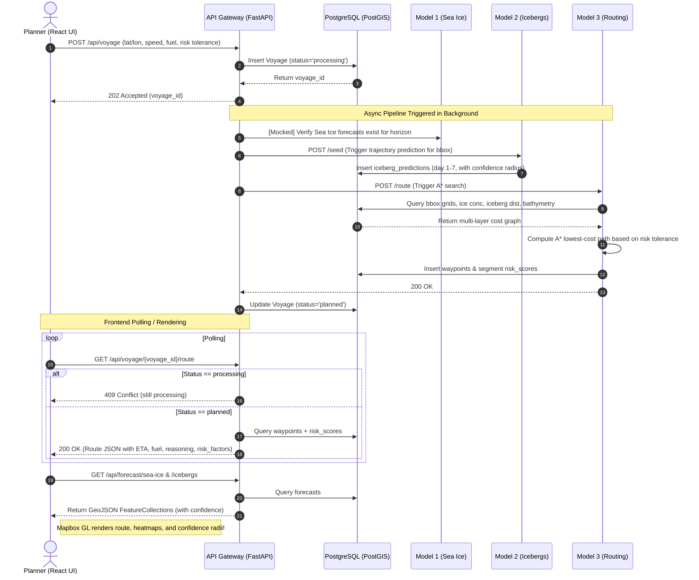

# API Gateway & Frontend Data Flow FAQ

**Target Audience:** Frontend Engineers, ML Integration Engineers, Project Managers  
**Purpose:** To explain exactly how the complex routing, confidence grading, and explainability features generated by the backend models are piped through the API Gateway and made available to the React frontend dashboard.

---

## 1. How does the AI Route Optimization Engine (Model 3) data reach the UI?

**Problem:** Manual route planning cannot jointly optimize for safety and fuel across a 7-day-ahead hazard picture, and cannot re-optimize quickly when conditions change.
**Implementation Flow:**
1. **Model 3 Execution:** The A* Routing engine evaluates the grid and computes the safest, most efficient path.
2. **Database Storage:** The `waypoints` table in PostgreSQL persists the resulting sequence: `sequence_no`, `position` (lat/lon), `eta`, `cumulative_fuel_l`, and `segment_risk_score`.
3. **API Gateway Delivery:** The `GET /api/voyage/{id}/route` endpoint fetches these waypoints in sequence. 
4. **Data Aggregation:** Before returning the data to the frontend, the API Gateway dynamically aggregates the final ETA, total fuel, and overall route risk score. 
5. **Explainability (UI Tooltips):** We over-deliver on explainability. The API returns a specific `risk_factors` object for each waypoint (the exact breakdown of ice vs. iceberg vs. weather risk), alongside a human-readable `reasoning` string (e.g., *"Path optimized for High risk tolerance. Avoided all critical hazards..."*) so the UI can explain *why* the engine chose that specific path.

---

## 2. How is the Voyage Setup & Live Dashboard orchestrated?

**Problem:** Planners need a single place to enter a voyage and see every relevant hazard layer together, instead of cross-referencing multiple separate charts.
**Implementation Flow:**
1. **Trigger:** The user submits the React frontend form. The frontend calls `POST /api/voyage` with the exact list of inputs (lat/lon, speed, fuel, departure, risk).
2. **Async Orchestration:** The API Gateway instantly returns a `202 Accepted` with a `voyage_id`, and triggers an asynchronous `process_voyage_pipeline` task in the background. This task sequentially triggers Model 1 (Sea Ice), Model 2 (Icebergs), and Model 3 (Routing).
3. **Dashboard Polling:** The React UI polls `GET /api/voyage/{id}/route` until it returns a `200 OK` (meaning the pipeline is complete), at which point it has all the data to draw the full route.
4. **Live Alerts:** The DB maintains an `alerts` table, and a `GET /api/alerts/{voyage_id}` endpoint is available for the UI to display real-time safety warnings on the dashboard.

---

## 3. How do we visualize Forecast Uncertainty?

**Problem:** Without an explicit signal, users tend to trust a Day-7 prediction as much as a Day-1 prediction, which is misleading given how uncertainty compounds over the forecast horizon.
**Implementation Flow:**
1. **Model Confidence Scores:** 
    - Model 1 (Sea Ice) writes a `confidence` float (0 to 1) to the `sea_ice_forecasts` table for every single grid cell, for every `horizon_day`.
    - Model 2 (Icebergs) writes a `confidence_radius_km` float to the `iceberg_predictions` table for every predicted position, for every `horizon_day`.
2. **GeoJSON Delivery:** The `GET /api/forecast/sea-ice` and `GET /api/forecast/icebergs` endpoints package this data and return standard **GeoJSON FeatureCollections**. 
3. **Frontend UI Rendering:** Inside the `properties` block of every GeoJSON feature, the API includes `horizon_day` and the respective confidence metrics. The Mapbox GL frontend can directly read these properties to dynamically adjust polygon opacity and circle radii using data-driven styling as the user scrubs the 7-day time slider.

---

---

## 4. End-to-End Flow: From User Input to Dashboard Visualization

To visualize exactly how the components interact from the moment a user submits a voyage to the moment the UI renders the final map, follow this sequence:

---

**Summary:** No mock data is required in the frontend for these features. Every single required data point is genuinely being calculated by the backend ML models, stored into the PostgreSQL database, and transmitted securely through the API Gateway endpoints.
